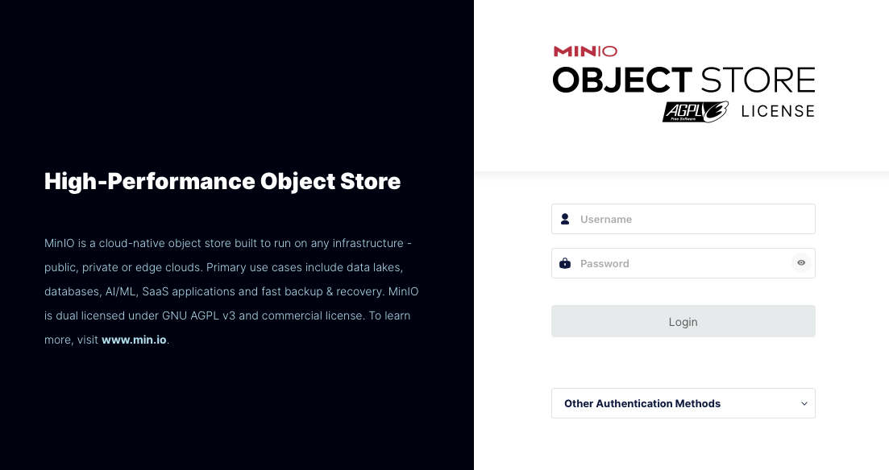
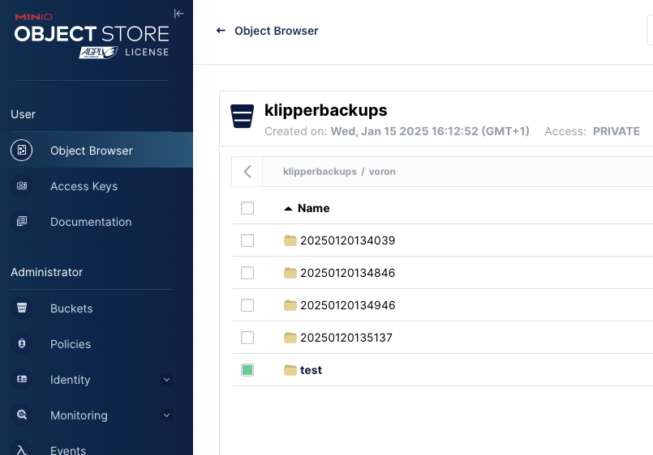

# klipper-s3bck

Backup Klipper to S3 Storage like Minio.

You need a dedicated linux server as the backup server. You can use a raspberry pi for it.


# Minio Install and Config

Install Minio on a System inside your local Network. 
I use a Raspberry PI5 with a 1TB NVMe drive.
I use *minio* as the hostname and *pi* as the username in the examples.

* **Step 1:** Download an install Minio
```shell
wget https://dl.min.io/server/minio/release/linux-arm64/archive/minio_20241218131544.0.0_arm64.deb -O minio.deb
sudo dpkg -i minio.deb
```

* **Step 2:** Create minio config file.

Minio configuration used by systemd is stored in /etc/default/minio

Here is a sample config.
```
pi@minio:~ $ cat /etc/default/minio 
# MINIO_ROOT_USER and MINIO_ROOT_PASSWORD sets the root account for the MinIO server.
# This user has unrestricted permissions to perform S3 and administrative API operations on any resource in the deployment.
# Omit to use the default values 'minioadmin:minioadmin'.
# MinIO recommends setting non-default values as a best practice, regardless of environment

MINIO_ROOT_USER=superadmin
MINIO_ROOT_PASSWORD='Ganz-sicheres-Password'

# MINIO_VOLUMES sets the storage volume or path to use for the MinIO server.

MINIO_VOLUMES="/minio-data"

# MINIO_OPTS sets any additional commandline options to pass to the MinIO server.
# For example, `--console-address :9001` sets the MinIO Console listen port
MINIO_OPTS="--console-address :9001"
```  
<br>
  
* **Step 3:** Change systemd config for minio

You need to change User and Group to you own needs.

```
sudo systemctl edit --full minio.service
```

* **Step 4:** Create data directory.

We need to create the data directory (MINIO_VOLUMES from config file) now.  
Place it whereever you want.

```shell
sudo mkdir /minio-data
sudo chown
sudo chmod 700 /etc/default/minio
```

* **Step 5:** Start Minio Service

We are ready to start the service.

```shell
systemctl enable --now minio.service
sudo systemctl status minio.service
```

The status output should look like this...

<code>
minio.service - MinIO\
     Loaded: loaded (/etc/systemd/system/minio.service; enabled; preset: enabled)\
     Active: active (running) since Fri 2025-01-17 15:46:51 CET; 1h 0min ago\
       Docs: https://docs.min.io\
   Main PID: 702 (minio)\
      Tasks: 10\
        CPU: 4.275s\
     CGroup: /system.slice/minio.service\
             └─702 /usr/local/bin/minio server --console-address :9001 /minio-data\
Jan 17 15:46:50 minio systemd[1]: Starting minio.service - MinIO...\
Jan 17 15:46:51 minio systemd[1]: Started minio.service - MinIO.\
Jan 17 15:46:51 minio minio[702]: MinIO Object Storage Server\
Jan 17 15:46:51 minio minio[702]: Copyright: 2015-2025 MinIO, Inc.\
Jan 17 15:46:51 minio minio[702]: License: GNU AGPLv3 - https://www.gnu.org/licenses/agpl-3.0.html\
Jan 17 15:46:51 minio minio[702]: Version: RELEASE.2024-12-18T13-15-44Z (go1.23.4 linux/arm64)\
Jan 17 15:46:51 minio minio[702]: API: http://10.2.1.213:9000  http://127.0.0.1:9000\
Jan 17 15:46:51 minio minio[702]: WebUI: http://10.2.1.213:9001 http://127.0.0.1:9001\
Jan 17 15:46:51 minio minio[702]: Docs: https://docs.min.io
</code>

# Minio Web Interface 

Its time to check the WEB Interface. Point your Browser to WebUI URL listed in the output from shown above.
e.g. http://10.2.1.213:9001

You can login with the credentials from /etc/default/minio 




# Minio CLI

Minio also has a Commandline Interface that needs to be installed on the Server and the Klipper Device (your printer).

### Ratos
There is no binary image for a 32 Bit Linux used by Ratrig Ratos. I made a 32 Bit Version; crosscompiled. I do not know if it is allowed to provide a binary version of the software here.

### Linux

As i am using a Rasberry PI5 for my Server and a PI4 for my printer, the installation is exactly the same.
You can find the mc on Github https://github.com/minio/mc 

* **Step 1:** Install CLI

Install the Minio CLI on Server and Printer.
```shell
curl https://dl.min.io/client/mc/release/linux-arm64/mc -o mc
chmod +x mc
sudo mv mc /usr/local/bin/
```

# Create Minio Backup User and Bucket

Now we need to create a backup user inside our Minio Server. The Bucket we create holds the buckup objets. We will use the user and bucket later on. Please note down both.

* **Step 1:** Create alias for the superadmin

On the Minio Server lets create an alias for the admin account from /etc/default/minio.

```shell
$ mc alias set local http://localhost:9000 superadmin 'Ganz-sicheres-Password'
```

* **Step 2:** Create backup user.

We create a user we will use for backup.
You can also use the Web GUI, but we will use the CLI here. Use a strong password please.

```shell
read -p "Passord: " password
mc admin user add local backup $password
mc admin policy attach local readwrite --user backup
#
mc alias set srvbackup http://localhost:9000 backup $password
```

* **Step 3:** Create bucket.
Lets create a bucket that holds the backup objects. I named the bucket **klipperbackups**.
We use the alias we created in the previous step.

```shell
$ mc mb --with-lock srvbackup/klipperbackups
```

# Setup on printer

Hopefully you allready installed the Minio CLI on your printer. If not please doit now.
What we need for setting up the our printer is:

* Name (FQDN) or IP of the Minio Server. ( I named mine it minio.localdomain )
* Minio user and password
* Bucketname

## Create an alias. 

```shell
read -p "Minio Server: " server
read -p "Minio Username: " username
read -p "Minio Passwor: " password 
mc alias set srvbackup http://${server}:9000 $username $password
```

## Lets check if we can see our bucket. 
      
```
pi@voron:~ $ mc ls srvbackup
[2025-01-15 16:12:52 CET]     0B klipperbackups/
```

## Clone from github.

```shell
cd
git clone https://github.com/hergla/klipper-s3bck.git
cd klipper-s3bck
```

## Edit the config file

There is a configfile called *.config* that needs to be edited. 
Use vi or nano to adapt to your own needs.

## Lets do a backup
When everthing is setup correctly, we are ready to start a backup
You can simply start it by running *s3back.sh* from the *klipper-s3bck* folder.

```
pi@voron:~/klipper-s3bck $ ./s3bck.sh
0=>/home/pi/printer_data/config
`/home/pi/printer_data/config/.moonraker.conf.bkp` -> `srvminio/klipperbackups/voron/20250120-132013/home/pi/printer_data/config/.moonraker.conf.bkp`
`/home/pi/printer_data/config/KlipperScreen.conf` -> `srvminio/klipperbackups/voron/20250120-132013/home/pi/printer_data/config/KlipperScreen.conf`
...
Total: 6.87 MiB, Transferred: 6.87 MiB, Speed: 22.15 MiB/s
```


# Restore 

You can launch the Web Interface and click on the *Object Browser*. Select a folder or file and then use the download action. 
I prefer not to download directly to the printer. You can do if you like to. Use the mc cli command ...



